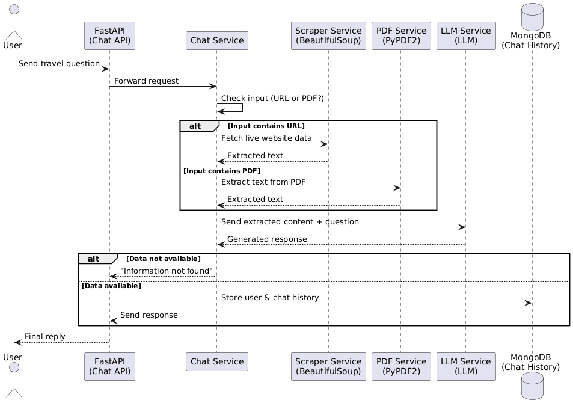

# Travel AI Chatbot

## Project Overview
The Travel AI Chatbot is a backend application built using FastAPI.  
It answers travel-related questions by dynamically fetching information from external travel websites or PDF files in real time.

The system does not store any travel data internally.

## Problem Statement
We need to build a travel-related AI chatbot that can answer user questions using information from external travel websites or PDF links.

The system:
- Does NOT store travel data
- Fetches data dynamically from URLs or PDFs
- Stores only user details and chat history
- Responds with “Information not found” if no data is available
- Does not allow admin to manually upload travel data

## Tech Stack
- Backend: FastAPI (Python)
- Database: MongoDB (for users and chat history)
- PDF Processing: PyPDF2
- Web Scraping: BeautifulSoup (dummy)
- API Documentation: Swagger UI
- Environment Management: Python dotenv

## Folder Structure
```text
travel_ai_chatbot/
│
├── app/
│   ├── main.py
│   ├── api/
│   │   └── v1/
│   │       ├── routes/
│   │       │   ├── chat.py
│   │       │   ├── pdfs.py
│   │       │   └── health.py
│   │       └── router.py
│   ├── services/
│   │   ├── chat_service.py
│   │   ├── llm_service.py
│   │   ├── pdf_service.py
│   │   └── scraper_service.py
│   ├── db/
│   │   ├── database.py
│   │   ├── models.py
│   │   └── crud.py
│   └── utils/
│       └── helpers.py
│
├── data/
│   └── pdfs/
├── tests/
├── .env
├── requirements.txt
└── README.md
```

## Data Flow Explanation
1. User sends a travel-related question through the chat API.
2. FastAPI receives the request.
3. Chat service checks whether the input contains a URL or PDF.
4. If it is a URL, scraper service fetches live data.
5. If it is a PDF, PDF service extracts the content.
6. Extracted content is passed to the LLM(Large Language Model) service.
7. LLM generates a response.
8. If information is not available, the chatbot returns “Information not found”.
9. Chat history is stored in MongoDB.

## API Endpoints
- GET `/` → Health check
- POST `/api/v1/chat` → Chat with AI
- GET `/api/v1/pdfs` → List PDFs

Swagger UI available at:  
http://127.0.0.1:8000/docs

### 1. Create virtual environment
```bash
python -m venv venv
```
### 2. Activate virtual environment
```bash
venv\Scripts\activate
```
### 3. Install dependencies
```bash
pip install -r requirements.txt
```
### 4. Run the server
```bash
uvicorn app.main:app --reload
```
### 5. Open browser
```bash
http://127.0.0.1:8000/docs
```
## Architecture Diagram


